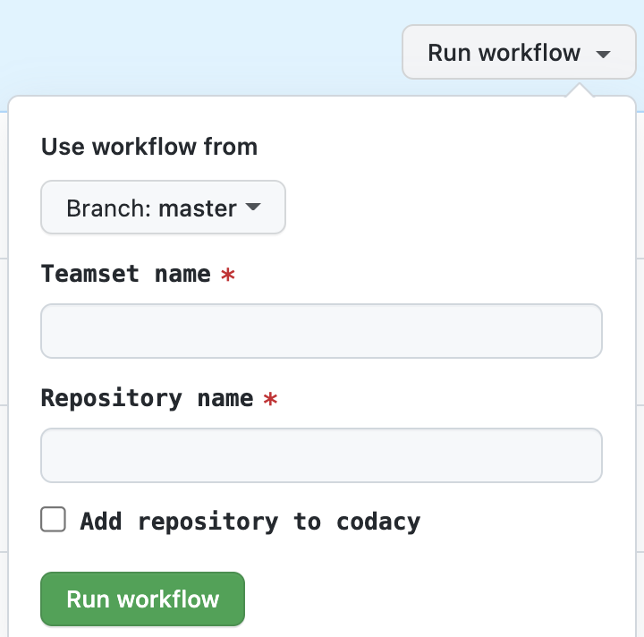

# Autonomy vs Governance - The Delicate Balance of Power

In larger organization there seems to be a constant jealousy amongst the developer community of the nimbleness and autonomy we find, many times in smaller organizations allowing to move fast. However, as you want to align over two thousands contributors on best practices as well as to spur innovation throughout the organization you realize that being too top down will result in squashing experimentation and being too ground up will result in many local optimization missing the chance to build upon success of others and not having to reinvent the wheel.
In addition we wanted to make sure we keep the overhead of managing such an aligned organization as low as possible. 

## The Origin Story
Ay Blue Yonder we strive, like in many other organizations, to grow by while making sure we minimize these growth bottlenecks. That means we want to adopt the best in breed technologies while allowing us not to be experts in these technologies and instead, focus our best and and brightest efforts on Blue Yonder's raison d'etre: Provide the our customers AI-driven Supply Chain Platform.
That means that we aim for any staff providing support the the product/services teams, to manage as little services and tools as possible. Let me pause to clarify a point of invisible toil here. Many times there a misconception that companies can easily run their own open source deployments or hosted Docker/Kubernetes services. Although that is most times true where you can run these with relatively cheap cloud resources, we forget the operational overhead of running such services such as have staff available to manage, tune and support these now critical system. Moreover you need to do it in a follow-the-sun capacity. 
For many years we managed many of these systems internally. From code management, SAST(Static code scanning), DAST(Dynamic Code Scanning) to CI/CD workers and more. 
As we were evaluating the transition these support systems to cloud vendor managed we were looking at criteria such as staff familiarity(productivity is king), security, extensibility and scalability. The choice was pretty clear for us as all the tea leaves of our business goals were pointing us to GitHub.  

## Trouble in Paradise
Everyone knows GitHub right? Problem solved!?
Not so quick. Although knowing how to utilize GitHub for open source project or small organizations with private repositories, it becomes more complex as you're trying to drive best practices throughout the organization of thousands of people with many of the following aspects:
1.  Permissions over thousands over repos (multi-repo) or really complex mono repos.
1.  Drive the adoption of [DevOps methodologies](https://medium.com/@raycad.seedotech/devops-methodology-and-process-dde388eb65bd), [Trunk Based Development](https://trunkbaseddevelopment.com/) and [Clean Code](https://www.freecodecamp.org/news/clean-coding-for-beginners/)
1. Adhere to regulations such as SOC 2 and SUX.
1. Drive innovation
1. Make it easy/familiar for team members to move from one team to another to re-balance needed.
1. Improve the metrics of TTFMPR(just made that acronym). Meaning: time to first meaningful pull request of a new engineer in the team. Never underestimate the feeling of accomplishment by newbies.
1. Achieve all of the above with a lean management overhead to prevent some of the operational management overhead described above.

Although, GitHub does provide organizational administration, it somewhat relies on the fact that you will have, for such a size of an organizations, a somewhat flat structure. Let's have a look at an illustration below that resembles the organizational structure of Blue Yonder's engineering groups.  

*Note*: There are many more product segments and product teams, but you get the idea.

```mermaid
graph TD
	DG[Blue Yonder] ---|BY Admins| 0[ ]
    style 0 width:0
    style DPA0 width:0
    0 --- DPA[Platform]
    DPA ---  |Platform Administrators| DPA0[ ]
	DPA0 --- DPAA[Pillar A]
    DPAA --- DPAAA[Team Bat]
    DPAA --- DPAAB[Team Antelope]
    DPAA --- DPAAC[Team Cheetah]

	DPA0 --- DPAB[Pillar B] 
    DPAB --- DPABA[Team Eagle]
    DPAB --- DPABB[Team Alligator]
    DPAB --- DPABD[Team Beetle]

	DPA0 --- DPAC0[Pillar C]
    DPAC0 ---  |Pillar C Administrators| DPAC[ ]
    DPAC --- DPACA[Team Eagle]
    DPAC --- DPACB[Team Alligator]
    DPAC --- DPACC[Team Raven]
    DPAC --- DPACD[Team Beetle]

    0 --- DPB[Product Segment A]
    DPB --- |Segment A Admins| DPB0[ ]
	DPB0 --- DPBA0[Product 1]
    DPBA0 ---  |Product 1 Administrators| DPBA[ ]
    DPBA --- DPBAA[Team Koala]
    DPBA --- DPBAB[Team Kiwi]
    DPBA --- DPBAC[Team Dingo]
    DPBA --- DPBAD[Team Dodo]
    DPB0 --- DPBP[Product 2]
	DPB0 --- DPBV[Product 3]
```

Imagine you want to organize some GitHub secrets that will be available to some groups but not others and every team might have many repos that will map to modules/services/apps. You also want to create reflect the hierarchy of the organization and make sure you can delegate to various parts of the the organization, admins that in turn can manage these specific parts or group of repos. We did look at concepts in GitHub such as projects, but these where not providing the hierarchy we needed but rather serve as a feature source of truth and project planning(For which we use Jira at Blue Yonder). The way teams are defined at GitHub did not give us the structure we needed and instead reflected inhabitance of permissions. 
Finally, we wanted to make sure that when someone creates a repository at Blue Yonder, it not only has the needed files(As GitHub template repos do), but they also reflect our best practices such forcing our flavors of branch protection, checks scans and designated teams for one or more repos. In our case we called it a team set.
### <a name="teamset"></a>A Team Set?
At Blue Yonder it is just a fancy name for a logical combination of 3 teams created together:
1. Admins - Can administer the repository
1. Collaborators - Can contribute to repository and are tasked with approving PR to be merged to main.
1. Contributors - Can create contributions but have to rely on the collaborators assigned to a repo to review and marge changes.
As mentioned, the concept of a team set is something we made up and it fitted best our structure. You can come up with your own. You can decide to assign existing team set to a repo or create a new one and then assign it.

As you may have noticed, we are weaving our very own data model an allowing the GitHub flexibility to work for us.
These abilities to tweak the administration to be low-touch and adhere to our best practices, does not come out of the box. Lucky enough, GitHub supports plethoras of APIs which allow you to re-imagine how your organization will look like and the secret weapon of GitOps.

## What is GitOps?

As some of you may have guessed, It's the combination of Git practices and Operations. More specifically the ability to manage your operations by defining the structures, configuration, infrastructure and interactions as Git operations with repositories. It heavily stole practices from the DevOps world([Thank you Picasso](https://www.creativethinkinghub.com/creative-thinking-and-stealing-like-an-artist/)).
That allows you to have define almost any structure you'd like, to define your organization as long as you can use the underlying API to reflect it (such as in the case of GitHub APIs). 
For instance, if you have one(or many) JSON/YAML files in such a management dedicated repository, the folks that want to contribute a change to which secret can be read by whom, which teams-sets should be created or assignment of lower levels admins, can be done through the same processes of code changes with pull request reviews and full auditing of such changes. Further, we can use mechanisms such as CI/CD to accept requests to create new repositories and we can generate repositories that adhere to out best practices, naming and the correct ownership. Further, anyone can see hwo these are implemented and suggest improvement to the process which goes to one of the [five ideals of DevOps](https://itrevolution.com/five-ideals-of-devops/): Improvement of daily work.

## How it's done at Blue Yonder?
To make sure we can maintain that delicate balance between governance of best practices and regulation and maintaining teams' autonomy to allow slim management operational overhead. There are many ways you could achieve the structures you'd like if the data model of a vendor, such as GitHub, does not give you the data model flexibility to do so. One of the more straight forward is to rely on the data models GitHub will give you + naming conventions. The gotcha is that you'll have to curate the processes that will use these naming conventions.
Considering the above structure, the naming conventions we landed on are:
`<segment>-<product>-<module>`
Example: `creatures-dragonnify-fire-breathing-service`
All the structure of segments, products and teams is a configuration JSON file in our GitOps repository of the organization.
```
{
  "creatures": {
    "name": "Creatures segment",
    "products": {
      "dragonnify": "Dragonnify product",
```
Anyone that wants to add/change a team just submits a pull request(PR) on this file. A small group of collaborators referred to in the [CODEOWNERS](https://docs.github.com/en/repositories/managing-your-repositorys-settings-and-features/customizing-your-repository/about-code-owners) file can do a quick review and if the JSON linting, done automatically on each such file passes, the file can be merged to [main](https://github.blog/changelog/2020-10-01-the-default-branch-for-newly-created-repositories-is-now-main/).   

### What About That Team Set?
We also said that we want each of the repo to have at least one [team set](#teamset) so that we can give team autonomy for teams to manage themselves while making sure we establish clear areas of responsibility for each repo.
Well, the team sets to can be a JSON file. Each team set can have one or more maintainer to later add members to the team and will result as mentioned above in 3 teams with an identical prefix. Example of such file:
```
[
    {
        "namePrefix": "Guardians of The Galaxy",
        "maintainers": [
            "Star-Lord_ghub",
            "Gamora-Zen_ghub",
```

The above will result in 3 teams:
1. Guardians of The Galaxy Admins
1. Guardians of The Galaxy Collaborators
1. Guardians of The Galaxy Contributors

Same as with the repo org structures, we maintain in the same repo a JSON file with the definitions of the team structure. Once the PR on the change of the file is approved, one of our GitOps GitHub Action workflows will read the file, check for changes from the previous version and then will add/remove/change the team set in the org.

## Let's Create Repos - The Way We Want Them
Now that we have the building blocks, how can we empower Blue Yonders to create their repos while making sure these adhere to the company standards? 
First, we make sure no one has the ability to create repos directly using the GitHub to make sure we align as a company.   
Second, we supply the team members with a GitHub Action pipeline to create new repositories while aligning on Blue Yonder naming conventions and structures with team sets we have defined in a GitOps contributing manner. Further we can hook it up to other vendors such as we do with [Codacy](https://app.codacy.com/)(which is a great service we use for code quality).  
  
Anyone at Blue Yonder can create such a repo. As part of the automation we:
1. Validate if the team set the exists and if so assign the teams in the team set to the repository.
2. Validate the repository naming
3. Create the branch protection rules that are the standards of Blue Yonder

